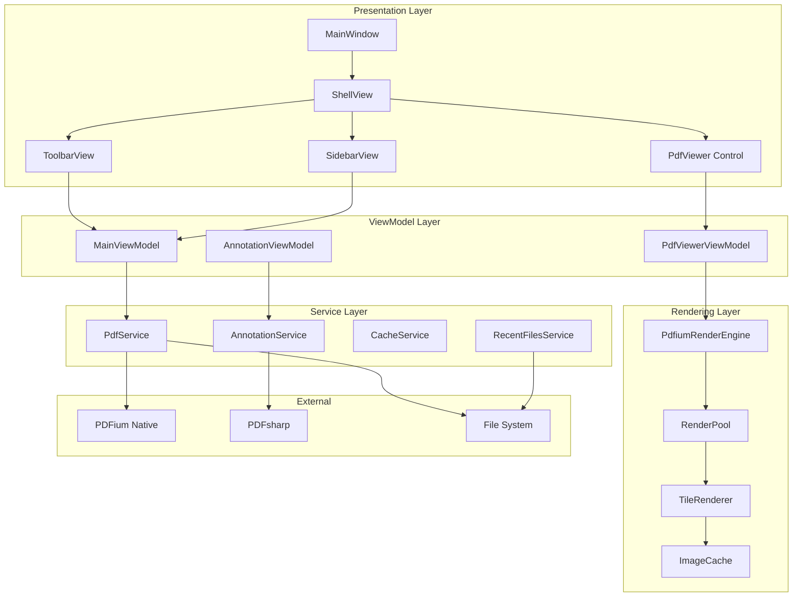
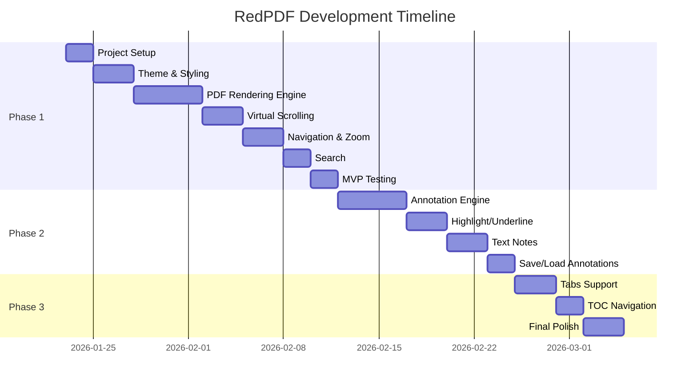

# RedPDF - Modern WPF PDF Viewer Implementation Plan

> **Project**: RedPDF - A lightweight, high-performance PDF viewer  
> **Framework**: WPF (.NET 8)  
> **Design Philosophy**: VS Code-inspired dark theme with minimal, clean UI

---

## 📋 Executive Summary

RedPDF is a modern, native Windows PDF viewer built with WPF and .NET 8, featuring a VS Code-inspired dark theme UI. The application prioritizes performance through virtual scrolling, intelligent caching, and asynchronous rendering.

---

## 🎯 Project Goals

1. **Performance**: Sub-100ms page render times with smooth scrolling
2. **Simplicity**: Clean, distraction-free reading experience
3. **Modern UI**: VS Code-inspired dark theme with proper proportions
4. **Annotation Support**: Highlight, underline, and text annotations
5. **Cross-Platform Ready**: Architecture supporting future .NET MAUI migration

---

## 🛠️ Technology Stack

### Core Framework

| Component | Technology | Version | License | Rationale |
|-----------|------------|---------|---------|-----------|
| **UI Framework** | WPF | .NET 8 | MIT | Native Windows, hardware-accelerated, mature ecosystem |
| **Runtime** | .NET 8 | 8.0.x LTS | MIT | Latest LTS, best performance, AOT support |
| **Language** | C# 12 | Latest | MIT | Modern features, pattern matching, primary constructors |

### PDF Libraries

| Component | Technology | NuGet Package | License | Rationale |
|-----------|------------|---------------|---------|-----------|
| **PDF Rendering** | PDFium (via PdfiumViewer.Native) | `PdfiumViewer.Native.x86_64.v8-xfa` | Apache 2.0 | Google's battle-tested renderer, best compatibility |
| **PDF Manipulation** | PdfPig | `PdfPig` | Apache 2.0 | Pure .NET, no native dependencies, text extraction |
| **Annotations** | PDFsharp | `PDFsharp` | MIT | Mature, well-documented, active development |

> [!TIP]
> **Alternative Rendering Options**:
> - **SkiaSharp + SkPDF**: Cross-platform, GPU-accelerated (Apache 2.0)
> - **Docnet.Core**: Modern PDFium wrapper with better API (MIT)
> - **Spire.PDF Free**: Limited free version, easy API (Proprietary Free Tier)

### UI Enhancement Libraries

| Component | Technology | NuGet Package | License | Rationale |
|-----------|------------|---------------|---------|-----------|
| **Modern UI Controls** | WPF-UI | `WPF-UI` | MIT | Fluent Design, VS Code-like styling |
| **Icons** | Segoe Fluent Icons | Built-in | Microsoft | Consistent Windows 11 look |
| **Animations** | Microsoft.Xaml.Behaviors.Wpf | `Microsoft.Xaml.Behaviors.Wpf` | MIT | Declarative animations |

### MVVM & Architecture

| Component | Technology | NuGet Package | License | Rationale |
|-----------|------------|---------------|---------|-----------|
| **MVVM Framework** | CommunityToolkit.Mvvm | `CommunityToolkit.Mvvm` | MIT | Source generators, minimal boilerplate |
| **DI Container** | Microsoft.Extensions.DependencyInjection | `Microsoft.Extensions.DependencyInjection` | MIT | Standard .NET DI |
| **Configuration** | Microsoft.Extensions.Configuration | `Microsoft.Extensions.Configuration` | MIT | Appsettings, user preferences |

---

## 🎨 UI/UX Design Specification

### VS Code-Inspired Color Palette

```css
/* Core Colors - VS Code Dark Theme */
--background-primary: #1E1E1E;      /* Main content area */
--background-secondary: #252526;    /* Sidebar, panels */
--background-tertiary: #2D2D30;     /* Hover states, cards */
--background-elevated: #3C3C3C;     /* Dropdowns, tooltips */

--border-primary: #3C3C3C;          /* Subtle borders */
--border-secondary: #4D4D4D;        /* Active borders */

--text-primary: #CCCCCC;            /* Main text */
--text-secondary: #8A8A8A;          /* Muted text */
--text-accent: #FFFFFF;             /* Headings, emphasis */

--accent-primary: #0078D4;          /* Primary actions */
--accent-secondary: #264F78;        /* Selection highlight */
--accent-hover: #1C86EE;            /* Hover states */

--success: #4EC9B0;                 /* Success states */
--warning: #CE9178;                 /* Warning states */
--error: #F14C4C;                   /* Error states */
```

### Layout Proportions

```
┌─────────────────────────────────────────────────────────────────┐
│  Title Bar (32px) - Draggable, custom chrome                    │
├──────────┬──────────────────────────────────────────────────────┤
│          │  Toolbar (40px) - Icons, search, zoom                │
│  Sidebar ├──────────────────────────────────────────────────────┤
│  (240px) │                                                      │
│          │                                                      │
│  • Pages │              PDF Content Area                        │
│  • TOC   │              (Flexible, centered)                    │
│  • Notes │                                                      │
│          │                                                      │
│          │                                                      │
├──────────┴──────────────────────────────────────────────────────┤
│  Status Bar (22px) - Page info, zoom, mode                      │
└─────────────────────────────────────────────────────────────────┘
```

### Typography

| Element | Font | Size | Weight | Color |
|---------|------|------|--------|-------|
| Window Title | Segoe UI | 12px | Regular | `--text-primary` |
| Toolbar Icons | Segoe Fluent Icons | 16px | Regular | `--text-primary` |
| Sidebar Headers | Segoe UI | 11px | Semibold | `--text-secondary` |
| Sidebar Items | Segoe UI | 13px | Regular | `--text-primary` |
| Status Bar | Segoe UI | 11px | Regular | `--text-secondary` |

---

## 🏗️ Architecture Design

### Project Structure

```
RedPDF/
├── src/
│   ├── RedPDF/                          # Main WPF application
│   │   ├── App.xaml                     # Application entry, resources
│   │   ├── MainWindow.xaml              # Shell window
│   │   ├── appsettings.json             # Configuration
│   │   │
│   │   ├── Assets/                      # Static resources
│   │   │   ├── Fonts/
│   │   │   ├── Icons/
│   │   │   └── Images/
│   │   │
│   │   ├── Themes/                      # XAML styles & themes
│   │   │   ├── Generic.xaml             # Base resource dictionary
│   │   │   ├── Colors.xaml              # Color definitions
│   │   │   ├── Controls.xaml            # Control styles
│   │   │   └── Dark.xaml                # Dark theme (default)
│   │   │
│   │   ├── Controls/                    # Custom WPF controls
│   │   │   ├── PdfViewer.xaml           # Main PDF rendering control
│   │   │   ├── PageThumbnail.xaml       # Sidebar page preview
│   │   │   ├── AnnotationOverlay.xaml   # Drawing layer
│   │   │   └── SearchPanel.xaml         # Search UI
│   │   │
│   │   ├── Views/                       # MVVM Views
│   │   │   ├── ShellView.xaml           # Main layout
│   │   │   ├── SidebarView.xaml         # Sidebar with pages/TOC
│   │   │   ├── ToolbarView.xaml         # Top toolbar
│   │   │   └── StatusBarView.xaml       # Bottom status
│   │   │
│   │   ├── ViewModels/                  # MVVM ViewModels
│   │   │   ├── MainViewModel.cs
│   │   │   ├── SidebarViewModel.cs
│   │   │   ├── PdfViewerViewModel.cs
│   │   │   └── AnnotationViewModel.cs
│   │   │
│   │   ├── Models/                      # Domain models
│   │   │   ├── PdfDocument.cs
│   │   │   ├── PdfPage.cs
│   │   │   ├── Annotation.cs
│   │   │   └── ViewSettings.cs
│   │   │
│   │   ├── Services/                    # Business logic
│   │   │   ├── IPdfService.cs
│   │   │   ├── PdfService.cs
│   │   │   ├── IAnnotationService.cs
│   │   │   ├── AnnotationService.cs
│   │   │   ├── ICacheService.cs
│   │   │   ├── PageCacheService.cs
│   │   │   └── RecentFilesService.cs
│   │   │
│   │   ├── Rendering/                   # PDF rendering engine
│   │   │   ├── IRenderEngine.cs
│   │   │   ├── PdfiumRenderEngine.cs
│   │   │   ├── RenderPool.cs            # Thread pool for rendering
│   │   │   └── TileRenderer.cs          # Tiled rendering for zoom
│   │   │
│   │   └── Helpers/                     # Utilities
│   │       ├── ImageCache.cs
│   │       ├── VirtualizingPanel.cs
│   │       └── KeyboardShortcuts.cs
│   │
│   └── RedPDF.Core/                     # Shared library (optional)
│       ├── Interfaces/
│       └── Extensions/
│
├── tests/
│   └── RedPDF.Tests/                    # Unit tests
│
├── docs/                                # Documentation
│
└── RedPDF.sln                           # Solution file
```

### Component Diagram



---

## ⚡ Performance Optimizations

### 1. Virtual Scrolling

```csharp
/// <summary>
/// Custom virtualizing panel that only renders visible pages
/// </summary>
public class VirtualizingPdfPanel : VirtualizingPanel
{
    // Only create UI elements for pages in viewport + buffer
    // Buffer: 2 pages above and below viewport
    private const int BufferPages = 2;
    
    protected override Size MeasureOverride(Size availableSize)
    {
        var visibleRange = CalculateVisibleRange();
        var extendedRange = ExtendRange(visibleRange, BufferPages);
        
        RecycleOffscreenContainers(extendedRange);
        GenerateContainers(extendedRange);
        
        return CalculateTotalExtent();
    }
}
```

### 2. Page Caching Strategy

```csharp
/// <summary>
/// LRU cache for rendered page images
/// </summary>
public class PageCacheService : ICacheService
{
    // Memory budget: 500MB max for cached pages
    private readonly MemoryCache _cache;
    private readonly long _maxMemoryBytes = 500 * 1024 * 1024;
    
    // Cache rendered pages at multiple zoom levels
    // Key format: "{documentId}_{pageIndex}_{zoomLevel}"
    public BitmapSource GetOrRender(
        string documentId, 
        int pageIndex, 
        double zoomLevel,
        Func<BitmapSource> renderFunc)
    {
        var key = $"{documentId}_{pageIndex}_{zoomLevel:F2}";
        
        if (_cache.TryGetValue(key, out BitmapSource cached))
            return cached;
            
        var rendered = renderFunc();
        _cache.Set(key, rendered, CalculateEvictionPolicy(rendered));
        return rendered;
    }
}
```

### 3. Async Rendering Pipeline

```csharp
/// <summary>
/// Background rendering with priority queue
/// </summary>
public class RenderPool
{
    private readonly Channel<RenderRequest> _highPriority;
    private readonly Channel<RenderRequest> _lowPriority;
    private readonly int _workerCount;
    
    public RenderPool(int workers = 4)
    {
        _workerCount = workers;
        _highPriority = Channel.CreateBounded<RenderRequest>(50);
        _lowPriority = Channel.CreateUnbounded<RenderRequest>();
        
        // Start worker threads
        for (int i = 0; i < _workerCount; i++)
            Task.Run(ProcessRenderQueue);
    }
    
    // Visible pages: high priority
    // Buffer pages: low priority
    public ValueTask QueueRender(RenderRequest request, bool highPriority)
    {
        var channel = highPriority ? _highPriority : _lowPriority;
        return channel.Writer.WriteAsync(request);
    }
}
```

### 4. Tiled Rendering for High Zoom

```csharp
/// <summary>
/// Tile-based rendering for zoom levels > 200%
/// </summary>
public class TileRenderer
{
    private const int TileSize = 256; // px
    
    public async IAsyncEnumerable<Tile> RenderTilesAsync(
        PdfPage page, 
        double zoomLevel,
        Rect viewport,
        [EnumeratorCancellation] CancellationToken ct)
    {
        var visibleTiles = CalculateVisibleTiles(page, zoomLevel, viewport);
        
        // Render center tiles first (spiral pattern)
        foreach (var tile in OrderByCenterDistance(visibleTiles))
        {
            ct.ThrowIfCancellationRequested();
            yield return await RenderTileAsync(page, tile, zoomLevel);
        }
    }
}
```

---

## 📦 NuGet Package Manifest

```xml
<!-- RedPDF.csproj -->
<Project Sdk="Microsoft.NET.Sdk">
  <PropertyGroup>
    <OutputType>WinExe</OutputType>
    <TargetFramework>net8.0-windows</TargetFramework>
    <UseWPF>true</UseWPF>
    <Nullable>enable</Nullable>
    <ImplicitUsings>enable</ImplicitUsings>
    <ApplicationIcon>Assets\Icons\redpdf.ico</ApplicationIcon>
    <PublishAot>false</PublishAot>
    <InvariantGlobalization>false</InvariantGlobalization>
  </PropertyGroup>

  <ItemGroup>
    <!-- PDF Rendering -->
    <PackageReference Include="Docnet.Core" Version="2.6.0" />
    <!-- OR: <PackageReference Include="PdfiumViewer.Native.x86_64.v8-xfa" Version="2018.4.8.256" /> -->
    
    <!-- PDF Manipulation & Annotations -->
    <PackageReference Include="PDFsharp" Version="6.1.1" />
    <PackageReference Include="PdfPig" Version="0.1.9" />
    
    <!-- Modern UI -->
    <PackageReference Include="WPF-UI" Version="3.0.5" />
    
    <!-- MVVM & DI -->
    <PackageReference Include="CommunityToolkit.Mvvm" Version="8.3.2" />
    <PackageReference Include="Microsoft.Extensions.DependencyInjection" Version="8.0.1" />
    <PackageReference Include="Microsoft.Extensions.Configuration.Json" Version="8.0.1" />
    <PackageReference Include="Microsoft.Extensions.Caching.Memory" Version="8.0.1" />
    
    <!-- Behaviors & Animations -->
    <PackageReference Include="Microsoft.Xaml.Behaviors.Wpf" Version="1.1.135" />
  </ItemGroup>
</Project>
```

---

## 🎨 Theme Implementation

### Colors.xaml

```xml
<ResourceDictionary xmlns="http://schemas.microsoft.com/winfx/2006/xaml/presentation"
                    xmlns:x="http://schemas.microsoft.com/winfx/2006/xaml">
    
    <!-- VS Code Dark Theme Colors -->
    
    <!-- Backgrounds -->
    <Color x:Key="BackgroundPrimaryColor">#1E1E1E</Color>
    <Color x:Key="BackgroundSecondaryColor">#252526</Color>
    <Color x:Key="BackgroundTertiaryColor">#2D2D30</Color>
    <Color x:Key="BackgroundElevatedColor">#3C3C3C</Color>
    
    <!-- Borders -->
    <Color x:Key="BorderPrimaryColor">#3C3C3C</Color>
    <Color x:Key="BorderSecondaryColor">#4D4D4D</Color>
    
    <!-- Text -->
    <Color x:Key="TextPrimaryColor">#CCCCCC</Color>
    <Color x:Key="TextSecondaryColor">#8A8A8A</Color>
    <Color x:Key="TextAccentColor">#FFFFFF</Color>
    
    <!-- Accent -->
    <Color x:Key="AccentPrimaryColor">#0078D4</Color>
    <Color x:Key="AccentSecondaryColor">#264F78</Color>
    <Color x:Key="AccentHoverColor">#1C86EE</Color>
    
    <!-- Status -->
    <Color x:Key="SuccessColor">#4EC9B0</Color>
    <Color x:Key="WarningColor">#CE9178</Color>
    <Color x:Key="ErrorColor">#F14C4C</Color>
    
    <!-- Brushes -->
    <SolidColorBrush x:Key="BackgroundPrimaryBrush" Color="{StaticResource BackgroundPrimaryColor}"/>
    <SolidColorBrush x:Key="BackgroundSecondaryBrush" Color="{StaticResource BackgroundSecondaryColor}"/>
    <SolidColorBrush x:Key="BackgroundTertiaryBrush" Color="{StaticResource BackgroundTertiaryColor}"/>
    <SolidColorBrush x:Key="BackgroundElevatedBrush" Color="{StaticResource BackgroundElevatedColor}"/>
    
    <SolidColorBrush x:Key="BorderPrimaryBrush" Color="{StaticResource BorderPrimaryColor}"/>
    <SolidColorBrush x:Key="BorderSecondaryBrush" Color="{StaticResource BorderSecondaryColor}"/>
    
    <SolidColorBrush x:Key="TextPrimaryBrush" Color="{StaticResource TextPrimaryColor}"/>
    <SolidColorBrush x:Key="TextSecondaryBrush" Color="{StaticResource TextSecondaryColor}"/>
    <SolidColorBrush x:Key="TextAccentBrush" Color="{StaticResource TextAccentColor}"/>
    
    <SolidColorBrush x:Key="AccentPrimaryBrush" Color="{StaticResource AccentPrimaryColor}"/>
    <SolidColorBrush x:Key="AccentSecondaryBrush" Color="{StaticResource AccentSecondaryColor}"/>
    <SolidColorBrush x:Key="AccentHoverBrush" Color="{StaticResource AccentHoverColor}"/>
    
</ResourceDictionary>
```

### Window Chrome Style

```xml
<!-- Custom window chrome matching VS Code -->
<Style x:Key="ModernWindowStyle" TargetType="Window">
    <Setter Property="WindowChrome.WindowChrome">
        <Setter.Value>
            <WindowChrome 
                CaptionHeight="32"
                ResizeBorderThickness="4"
                GlassFrameThickness="0"
                UseAeroCaptionButtons="False"
                CornerRadius="0"/>
        </Setter.Value>
    </Setter>
    <Setter Property="Background" Value="{StaticResource BackgroundPrimaryBrush}"/>
    <Setter Property="BorderBrush" Value="{StaticResource BorderPrimaryBrush}"/>
    <Setter Property="BorderThickness" Value="1"/>
</Style>
```

---

## 📱 Feature Specification

### Phase 1: Core Viewer (MVP)

| Feature | Priority | Complexity | Description |
|---------|----------|------------|-------------|
| Open PDF | P0 | Low | File dialog, drag-drop, command line |
| Page Rendering | P0 | High | PDFium-based rendering with caching |
| Navigation | P0 | Medium | Scroll, page jump, keyboard shortcuts |
| Zoom | P0 | Medium | Fit width, fit page, custom zoom (25%-400%) |
| Search | P0 | Medium | Text search with highlighting |
| Print | P1 | Medium | System print dialog integration |
| Dark Theme | P0 | Low | VS Code-inspired styling |

### Phase 2: Annotations

| Feature | Priority | Complexity | Description |
|---------|----------|------------|-------------|
| Highlight | P1 | High | Yellow highlight with color options |
| Underline | P1 | Medium | Text underline annotation |
| Text Notes | P1 | High | Sticky notes on pages |
| Freehand Draw | P2 | High | Pen/pencil drawing |
| Save Annotations | P1 | High | Embed in PDF or separate file |

### Phase 3: Advanced Features

| Feature | Priority | Complexity | Description |
|---------|----------|------------|-------------|
| Tabs | P2 | Medium | Multiple documents in tabs |
| Bookmarks | P2 | Low | User-defined bookmarks |
| Recent Files | P1 | Low | Quick access to recent documents |
| TOC Navigation | P1 | Medium | Table of contents sidebar |
| Presentation Mode | P2 | Low | Full-screen slideshow |

---

## ⌨️ Keyboard Shortcuts

| Action | Shortcut | Description |
|--------|----------|-------------|
| Open File | `Ctrl+O` | Open file dialog |
| Close | `Ctrl+W` | Close current document |
| Print | `Ctrl+P` | Print dialog |
| Find | `Ctrl+F` | Open search panel |
| Find Next | `F3` / `Enter` | Next search result |
| Zoom In | `Ctrl++` / `Ctrl+Scroll` | Increase zoom |
| Zoom Out | `Ctrl+-` / `Ctrl+Scroll` | Decrease zoom |
| Fit Width | `Ctrl+1` | Fit to window width |
| Fit Page | `Ctrl+0` | Fit entire page |
| Next Page | `Page Down` / `Right` | Go to next page |
| Prev Page | `Page Up` / `Left` | Go to previous page |
| First Page | `Home` | Jump to first page |
| Last Page | `End` | Jump to last page |
| Go To Page | `Ctrl+G` | Page number dialog |
| Toggle Sidebar | `Ctrl+B` | Show/hide sidebar |
| Full Screen | `F11` | Toggle presentation mode |

---

## 🧪 Verification Plan

### Automated Tests

```powershell
# Run unit tests
dotnet test tests/RedPDF.Tests --configuration Release

# Run with coverage
dotnet test tests/RedPDF.Tests --collect:"XPlat Code Coverage"
```

**Test Categories:**
- **Rendering Tests**: Verify page rendering at various zoom levels
- **Cache Tests**: LRU eviction, memory limits
- **Navigation Tests**: Page jumping, scroll synchronization
- **Annotation Tests**: Create, save, load annotations
- **Performance Tests**: Render time benchmarks

### Manual Verification

1. **Load Testing**: Open 500+ page PDFs
2. **Memory Profiling**: Verify cache limits respected
3. **UI Responsiveness**: Smooth scrolling at 60fps
4. **Annotation Persistence**: Save/reload annotations
5. **Cross-DPI Testing**: High DPI monitor support

---

## 📅 Implementation Timeline



---

## 🔧 Development Commands

```powershell
# Create solution
dotnet new sln -n RedPDF

# Create WPF project
dotnet new wpf -n RedPDF -f net8.0-windows

# Add to solution
dotnet sln add src/RedPDF/RedPDF.csproj

# Install packages
cd src/RedPDF
dotnet add package WPF-UI
dotnet add package CommunityToolkit.Mvvm
dotnet add package Docnet.Core
dotnet add package PDFsharp
dotnet add package PdfPig
dotnet add package Microsoft.Extensions.DependencyInjection
dotnet add package Microsoft.Extensions.Configuration.Json
dotnet add package Microsoft.Extensions.Caching.Memory
dotnet add package Microsoft.Xaml.Behaviors.Wpf

# Run application
dotnet run

# Publish single-file executable
dotnet publish -c Release -r win-x64 --self-contained -p:PublishSingleFile=true
```

---

## 📎 Reference UI

The application UI should match the VS Code styling shown below:


**Key Visual Elements:**
- **Dark background** (#1E1E1E) for main content
- **Slightly lighter sidebar** (#252526)
- **Minimal borders** using subtle grays
- **Consistent icon sizing** (16px)
- **Proper spacing** and padding throughout

---

## ✅ Success Criteria

- [ ] Open and render PDFs under 100ms for first page
- [ ] Smooth 60fps scrolling on 100+ page documents
- [ ] Memory usage under 500MB for large documents
- [ ] All keyboard shortcuts functional
- [ ] Annotations save and reload correctly
- [ ] UI matches VS Code dark theme aesthetics
- [ ] No UI freezing during background operations

---

> [!IMPORTANT]
> This plan uses the **latest stable versions** of all libraries as of January 2026. All libraries are **MIT or Apache 2.0 licensed** (free for commercial use).
